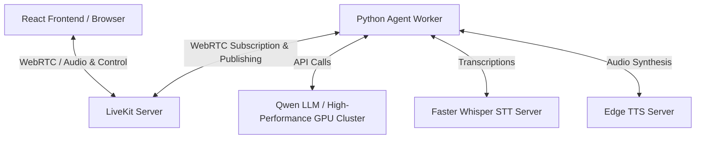

# 🎙️ Personal Voice Agent

A sophisticated, ultra-responsive, real-time voice assistant built with a modern stack leveraging **LiveKit**, **Faster-Whisper** (Speech-to-Text), **Edge-TTS** (Text-to-Speech), and **Qwen LLM** (vLLM) running on a high-performance GPU cluster.

This project delivers a seamless voice interaction experience through a high-performance Selective Forwarding Unit (SFU) with minimal latency and a beautiful, dynamic frontend.

---

## 🏗️ Architecture



### Key Components:
1. **Frontend (Vite + React)**: A lightweight, responsive web interface that manages microphone access, renders audio streams via `<RoomAudioRenderer />`, and visualizes both agent states and voice activity volume.
2. **LiveKit Server (SFU)**: Manages real-time WebRTC connections, audio forwarding, and agent job dispatching.
3. **Agent Worker (Python)**: Subscribes to room audio events, processes speech using Voice Activity Detection (Silero VAD), and coordinates STT, LLM, and TTS pipelines.
4. **Faster-Whisper (STT)**: A local container running high-accuracy, CPU-optimized whisper-base model for instant speech transcriptions.
5. **Edge-TTS (TTS)**: An OpenAI-compatible local TTS microservice wrapping Microsoft Edge's high-quality neural voices.
6. **Qwen LLM**: A vLLM server hosted on a remote high-performance GPU cluster for blazing-fast, conversational answers.

---

## 🛠️ Tech Stack

* **Frontend**: React 18, Vite, HSL-tailored CSS styling, LiveKit Components React SDK
* **Backend Worker**: Python 3.11, LiveKit Agents SDK, Silero VAD
* **Services**: Docker Compose, Nginx (frontend serving), Uvicorn / FastAPI (TTS and Token server), Faster-Whisper Server
* **LLM**: Qwen running on remote vLLM

---

## 🚀 Quick Start (Docker Compose)

### 1. Prerequisites
Make sure you have [Docker](https://www.docker.com/) and Docker Compose installed on your system.

### 2. Configure Environment
Copy the example environment file and customize it:
```bash
cp .env.example .env
```
Ensure your `.env` contains the correct LLM settings:
```ini
OPENAI_API_KEY=sk-your-api-key-here
OPENAI_BASE_URL=https://gpu-cluster.yourdomain.com/v1
OPENAI_MODEL=qwen3.6
```

### 3. Run the Stack
Start all components in detached mode:
```bash
docker compose up --build -d
```
This command builds and launches:
- **LiveKit Server** (`ws://localhost:7880`)
- **Faster-Whisper Server** (`http://localhost:8083`)
- **Edge-TTS Server** (`http://localhost:8082`)
- **Token Server** (`http://localhost:8081`)
- **Agent Worker** (connected internally)
- **Frontend** (`http://localhost:3000`)

### 4. Talk to your Agent
Open your browser and navigate to:
```
http://localhost:3000
```
Click **Start Conversation**, allow microphone access, and start talking!

---

## 💡 How it Works Under the Hood

1. **VAD Trigger**: When you speak, **Silero VAD** on the Agent worker detects voice activity.
2. **STT Transcription**: The captured audio is sent to the local **Faster-Whisper** server, transcribing your speech into text.
3. **LLM Reasoning**: The transcribed text is sent to the high-performance **Qwen LLM** which yields a streaming conversational response.
4. **TTS Synthesis**: The stream is passed to the **Edge-TTS** microservice, producing clear, high-quality audio segments.
5. **WebRTC Playback**: The audio is published back into the LiveKit room, where the frontend plays it back instantly to the user using WebRTC.
